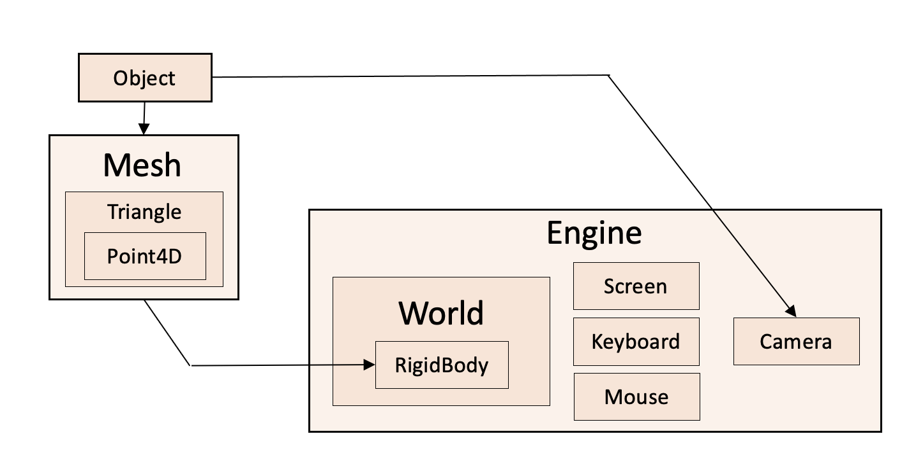

# 3D Game Engine — JamLearn

## General project structure


## Tasks

The tasks are in the `lesson<N>.cpp` files

You need to implement all the places of the 3D engine that are marked with the TODO label

## Installation and launch

### Dependency

- Download and install the [OpenAL](https://openal.org/downloads/) library, which is necessary for sound support in SFML (without [OpenAL](https://openal.org/downloads/) the engine will not start)
- Install [SFML](https://www.sfml-dev.org/download.php) on your system (**The compiler version must match 100%**)

**Or use your package manager**

```bash
$ apt install -y mesa-utils libsfml-dev freeglut3-dev
```

### Create a new repository

- Click [Use this template/Create a new repository](https://github.com/new?template_name=jam-game-engine&template_owner=ilyar)
- Use type **private repository** - this is necessary so that the solutions to the lessons remain unknown, this is important for the learning process
- Implement and build the project, adding one of the `lesson<N>.cpp` files to the build target
- When you commit and push to your private GitHub repository, the action starts building your solution
> [!CAUTION]
> ❗ Note that for this you need to uncomment the corresponding lines in the file [qa.yml](.github/workflows/qa.yml)

**For local run** 
```bash
rm -rf build && mkdir build
cmake -B build -DCMAKE_BUILD_TYPE=Debug
cmake --build build --parallel $(nproc) --target TEST_SCENE
./TEST_SCENE

cmake --build build --parallel $(nproc) --target LESSON_<N>
./LESSON_<N>
```

If you have any difficulties working with the repository or find a bug, it is best to create an [issue](https://github.com/ilyar/jam-game-engine/issues)
